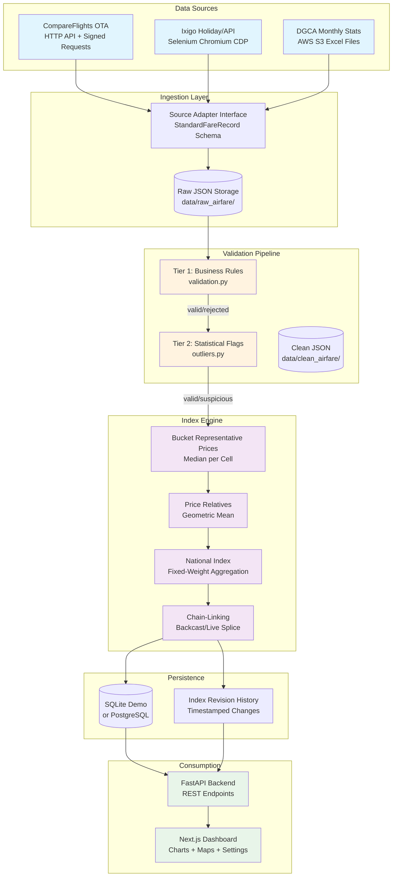
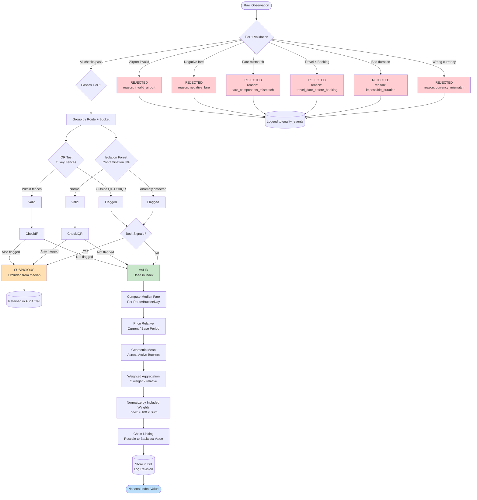

# Airfare Price Index — Indian Domestic Aviation

A production-grade pipeline for computing auditable airfare price indices from OTA sources and DGCA passenger traffic statistics. Implements two-layer validation with statistical outlier detection, fixed-weight Laspeyres aggregation, and chain-linked time series.

**Status**: Research prototype — not an official MoSPI/CPI statistic.

---

## Table of Contents

- [Features](#features)
- [Quick Start](#quick-start)
- [System Architecture](#system-architecture)
- [Data Pipeline Flowchart](#data-pipeline-flowchart)
- [Source Integration Layer](#source-integration-layer)
- [Two-Layer Validation System](#two-layer-validation-system)
- [Index Computation Engine](#index-computation-engine)
- [Route Basket & Weights](#route-basket--weights)
- [Configuration Reference](#configuration-reference)
- [Repository Structure](#repository-structure)
- [Testing & Quality Assurance](#testing--quality-assurance)

---

## Features

### Data Collection
- **Multi-source OTA integration**: CompareFlights (HTTP API), Ixigo (Selenium Chromium automation)
- **DGCA monthly statistics**: Automated Excel parsing from AWS S3, 12-month rolling window
- **Adaptive scheduling**: Independent scrape times per source, configurable via dashboard
- **Date-partitioned storage**: Raw JSON organized by source and date, versioned clean snapshots
- **Holiday calendar integration**: Automatic fetching of Indian public holidays from Ixigo API

### Validation & Quality Control
- **Tier 1 — Business rules**: Airport code validation, fare arithmetic checks, temporal constraints, currency enforcement
- **Tier 2 — Statistical detection**: Per-cell IQR fences (Tukey method), Isolation Forest multivariate analysis, corroborating signal requirement
- **Three-tier classification**: `valid` / `suspicious` / `rejected` — suspicious rows retained in audit trail, excluded from median calculation
- **Duplicate deduplication**: Source-level dedup on rounded timestamps before entering clean layer

### Index Methodology
- **Elementary aggregates**: Route + cabin class + departure bucket (B1-B6, 0-3 to 61+ days)
- **Geometric mean aggregation**: ILO/IMF CPI Manual compliant, avoids upward bias from divergent relatives
- **Laspeyres fixed-weight formula**: Base-period weights from DGCA passenger traffic, proportionally redistributed when routes excluded
- **Chain-linking**: Seamless splice between simulated backcast and live observations at shared date
- **Revision policy**: Late-arriving data triggers recomputation of affected dates only, full history preserved

### Architecture
- **Pure function index engine**: No I/O, no side effects, deterministic outputs — trivially unit-testable
- **Source adapter abstraction**: Uniform `StandardFareRecord` interface across all collectors
- **Dual persistence paths**: SQLite for demo/dev (zero dependencies), PostgreSQL schema for production
- **Background worker**: APScheduler-based job orchestration, resume-capable from incomplete runs
- **RESTful API**: FastAPI backend with Swagger UI, typed request/response contracts

### Dashboard & Visualization
- **Next.js frontend**: Time-series charts (Recharts), Leaflet route maps, airline breakdown views
- **Settings management**: Runtime scraper configuration via `/api/scraper-config`, no restart required
- **Source health monitoring**: Success/failure tracking, HTTP status logging, browser viewport diagnostics
- **Lead-time analysis**: T+1 through T+45 day fare windows, advance purchase pattern visualization

---

## Quick Start

### Prerequisites
- Python 3.11+
- Node.js 18+ (for frontend dashboard)
- Chrome or Chromium browser (for Selenium-based scrapers)

### Setup

```powershell
# Create virtual environment
python -m venv .venv
.\.venv\Scripts\Activate.ps1

# Install core dependencies
pip install -r requirements.txt

# Run backend API
$env:PYTHONPATH = "."
python -m uvicorn backend.app.main:app --host 127.0.0.1 --port 8000 --reload

# Run frontend (separate terminal)
cd frontend
npm install
npm run dev
```

**Access points**:
- Dashboard: `http://127.0.0.1:3000`
- API docs: `http://127.0.0.1:8000/docs`
- Health check: `http://127.0.0.1:8000/api/health`

### Scraper Dependencies

```powershell
pip install -r requirements-scrapers.txt

# Ensure Chrome/Chromium is installed and available on PATH
# Verify with: chromium --version  OR  chrome --version
```

### Worker Scheduling

```powershell
$env:PYTHONPATH = "."
python scripts/run_worker.py
```

Default schedule: CompareFlights at 06:00, Ixigo at 06:30, DGCA basket on day 1 at 09:30 (all local time).

---

## System Architecture



---

## Data Pipeline Flowchart



---

## Source Integration Layer

### Source Adapter Pattern

All data collectors implement a uniform interface defined in `scraper/base.py`:

```python
class SourceAdapter(ABC):
    name: str                    # e.g., "compareflights", "ixigo"
    source_type: str             # "ota" | "airline" | "mock"
    parser_version: str          # Versioned for reproducibility

    @abstractmethod
    def collect(self, request: SearchRequest) -> AdapterResult:
        """Collect one source result and return standardized records."""
```

### Active Sources

#### CompareFlights (`scraper/ota/compareflights/`)
- **Method**: Signed HTTP requests to Travelpayouts white-label API
- **Flow**: Sign search → Start session → Poll results endpoint
- **Technology**: Direct API calls, no browser automation
- **Schedule**: Daily at 06:00 local time (configurable)
- **Output**: One route file per date with all T+n lead-time windows embedded
- **Storage**: `data/raw_airfare/compareflights/YYYY-MM-DD/<ROUTE>.json`
- **Config keys**: `compareflights_headless`, `compareflights_time`, `compareflights_marker`

#### Ixigo OTA (`scraper/ota/ixigo_holiday.py` + Selenium driver)
- **Method**: Browser automation capturing CDP network stream
- **Technology**: Selenium Chromium with Chrome DevTools Protocol
- **Features**:
  - Intercepts `/flights/v2/search/stream` SSE responses
  - Persists browser profile for session continuity
  - Fetches holiday calendar from Ixigo API (`ixigo.com/growth/api/v1/holidayCalendar`)
  - Configurable parallel drivers (default max 4), viewport (1920x1080)
- **Schedule**: Daily at 06:30 local time
- **Output**: One route file per date containing all T+ lead-time windows (T+1, T+7, T+15, T+30, T+45)
- **Storage**: `data/raw_airfare/ixigo/YYYY-MM-DD/<ROUTE>.json`
- **Config keys**: `ixigo_driver`, `ixigo_headless`, `ixigo_lead_days`, `ixigo_route_delay_seconds`, `ixigo_retry_count`

#### DGCA Statistics (`airfare/dgca/pipeline.py`)
- **Method**: Download Excel files from AWS S3 public bucket
- **URL**: `https://public-prd-dgca.s3.ap-south-1.amazonaws.com/inventoryList/dataReports/aviationDataStatistics/airTransport/domestic/monthly/`
- **Frequency**: Monthly on day 1 at 09:30
- **Purpose**: Build route basket from actual passenger traffic data (last 12 complete months)
- **Processing**:
  - Handles filename variations and whitespace quirks
  - Parses city-pair bidirectional passenger counts
  - Matches cities to airport codes via `IndiaAirports.json` lookup
  - Ranks routes by `total_pax_12_months`
  - Computes directional weights (bidirectional mode splits pair weight 50/50)
- **Output**: `data/dgca/output/top50.json` with snapshot versioning

### Standardized Record Schema

All sources produce `StandardFareRecord` objects (`airfare/sources/base.py`):

```python
@dataclass
class StandardFareRecord:
    source_name: str              # "compareflights", "ixigo"
    observed_at: datetime
    origin: str                   # IATA code (e.g., "DEL")
    destination: str              # IATA code (e.g., "BOM")
    travel_date: date
    advance_purchase_days: int    # Days between booking and travel
    availability_status: Literal["AVAILABLE", "SOLD_OUT", "CANCELLED", "SOURCE_ERROR"]
    airline_code: str | None      # e.g., "6E"
    airline_name: str | None      # e.g., "IndiGo"
    flight_number: str | None
    departure_datetime: datetime | None
    arrival_datetime: datetime | None
    duration_minutes: int | None
    stops: int | None
    cabin_class: str              # "Economy", "Business", etc.
    components: FareComponents    # base_fare, taxes, fees breakdown
    currency: str                 # Always "INR" for domestic
    source_payload: dict          # Original raw response (preserved for audit)
```

---

## Two-Layer Validation System

### Layer 1: Business Rule Validation (`data_pipeline/validation.py`)

Applied row-by-row **before** any data enters the clean dataset. Uses deterministic checks against known constraints.

| Check | Condition | Action |
|-------|-----------|--------|
| **Invalid airport** | Airport code not in `IndiaAirports.json` | `quality_status = "rejected"` |
| **Origin equals destination** | `origin == destination` | `quality_status = "rejected"` |
| **Negative fare** | `total_fare < 0` OR `base_fare < 0` OR `taxes < 0` | `quality_status = "rejected"` |
| **Fare component mismatch** | `|base_fare + taxes - total_fare| > 5.0` | `quality_status = "rejected"` |
| **Travel before booking** | `travel_date < booking_ts.date()` | `quality_status = "rejected"` |
| **Impossible duration** | `duration_minutes < 20` OR `> 900` | `quality_status = "rejected"` |
| **Currency mismatch** | `currency != "INR"` | `quality_status = "rejected"` |

**Output**: Adds `quality_status` column (`"valid"` or `"rejected"`) and `reject_reasons` text field. Rejected rows never enter index calculation but are logged to `data_quality_events`.

### Layer 2: Statistical Outlier Detection (`data_pipeline/outliers.py`)

Operates **only on tier-1 valid rows**, grouped by `(route, departure_bucket)` cell. Uses two independent methods as corroborating signals — neither alone triggers deletion.

#### Method A: IQR (Interquartile Range) — Primary Signal

For each `(route, departure_bucket)` group with ≥4 observations:

```
Q1 = fares.quantile(0.25)
Q3 = fares.quantile(0.75)
IQR = Q3 - Q1

lower_fence = Q1 - 1.5 × IQR
upper_fence = Q3 + 1.5 × IQR

is_outlier = (fare < lower_fence) OR (fare > upper_fence)
```

- **Multiplier**: 1.5× (standard Tukey fence, configurable in `methodology.py`)
- **Minimum sample**: 4 observations per cell (skipped if fewer)

#### Method B: Isolation Forest — Corroborating Signal

Multivariate anomaly detection using sklearn:

```python
features = [total_fare, days_to_departure, stops]
model = IsolationForest(contamination=0.03, random_state=42)
predictions = model.fit_predict(features)
is_outlier = (predictions == -1)  # -1 indicates anomaly
```

- **Contamination rate**: 3% (assumes ~3% of prices are genuine anomalies)
- **Minimum sample**: 20 observations per cell (skipped if fewer)
- **Features**: Fare amount, temporal distance, routing complexity

### Final Quality Status Assignment

```python
if tier1_rejected:
    quality_status = "rejected"       # Never enters index, logged to audit

elif iqr_outlier and isolation_forest_outlier:
    quality_status = "suspicious"     # Excluded from median, kept in raw table

else:
    quality_status = "valid"          # Used in index computation
```

**Key Principle**: Suspicious ≠ Deleted. Flagged rows are retained in the raw observation table for audit transparency but excluded from the median price calculation used in the index. This distinguishes three categories:

1. **Clearly invalid** (tier-1 reject) — negative fares, impossible dates
2. **Statistically suspicious** (tier-2 flag) — outside expected range, needs corroboration
3. **Genuine unusual price** (valid) — promotions, demand spikes confirmed across sources

---

## Index Computation Engine

All index computation lives in pure functions (`index_engine/`) with no I/O or side effects. Same inputs always produce same outputs.

### Module Structure

| File | Purpose |
|------|---------|
| `methodology.py` | Central constants: `BASE_PERIOD`, `DEPARTURE_BUCKETS`, thresholds |
| `basket.py` | Route basket definition from DGCA traffic data |
| `weights.py` | Compute route weights from passenger counts |
| `price_relative.py` | Compute per-route price relatives (geometric mean) |
| `index.py` | Aggregate route relatives into national index |
| `chain_link.py` | Splice backcast onto live series seamlessly |
| `alerts.py` | Generate data-quality alerts (low coverage, missing sources) |
| `airport_coords.py` | Geographic coordinates for map visualization |

### Computation Steps

#### Step 1: Bucket Representative Price

For each `(origin, destination, departure_bucket, day)` cell:

```python
representative_price = median([
    obs.total_fare 
    for obs in observations 
    if obs.quality_status == "valid"
])
```

Uses **median** (not mean) to reduce sensitivity to extreme values within already-filtered data. Suspicious rows excluded per METHODOLOGY.md §8.

#### Step 2: Route Price Relative

For each route on day *t*, compute geometric mean of matched bucket relatives:

```python
relatives = []
for bucket in base_period_buckets:
    if bucket in current_day_buckets:
        relative = current_price[bucket] / base_price[bucket]
        relatives.append(relative)

route_relative = exp(mean(log(relatives)))  # Geometric mean in log-space
```

**Why geometric mean?** Standard CPI practice per ILO/IMF Consumer Price Index Manual — avoids upward bias when relative prices diverge, consistent under time-reversal test.

#### Step 3: National Index Aggregation

Laspeyres-style fixed-weight formula:

```
National_Index(t) = 100 × Σ[weight_i × price_relative_i] / Σ(included_weights)
```

**Route inclusion criteria:**
- Minimum **5 weekly observations** required (configurable via `MIN_WEEKLY_OBSERVATIONS_FOR_ROUTE`)
- If route has no data → excluded, weight redistributed proportionally to remaining routes
- Routes below threshold trigger data-quality alert

**Weight normalization**: Happens automatically over included subset — mathematically equivalent to explicit redistribution.

#### Step 4: Chain-Linking (Seamless Splicing)

**Problem**: Live scraping starts mid-year; cannot have genuine January 2026 prices. Solution: statistically generated backcast from Jan 2026 to launch date, spliced to live observations.

```python
splice_date = first_live_date
link_factor = backcast_series[splice_date] / live_series[splice_date]

linked_series = backcast_series + [
    LinkedIndexPoint(date=d, index_value=v × link_factor, data_mode="live")
    for d, v in live_series[1:]
]
```

Dashboard shows visible boundary marker between simulated (`data_mode="simulated_backcast"`) and live (`data_mode="live"`) segments.

### Departure Buckets

| Bucket | Days to Departure | Purpose |
|--------|-------------------|---------|
| B1 | 0–3 days | Last-minute bookings |
| B2 | 4–7 days | Short advance |
| B3 | 8–14 days | Medium advance |
| B4 | 15–30 days | Planned travel |
| B5 | 31–60 days | Early booking |
| B6 | 61+ days | Very early / flexible |

Each bucket controls for booking-curve dynamics — price rises mechanically as departure approaches. Without this control, the index would conflate genuine inflation with normal pricing patterns.

---

## Route Basket & Weights

### Basket Construction (`airfare/dgca/basket.py`)

Sources top-N domestic routes from DGCA monthly statistics:

1. Download last 12 complete months of city-pair data from AWS S3
2. Parse Excel files (handle filename variations, whitespace normalization)
3. Clean city names using regex matching to `IndiaAirports.json`
4. Match cities to airport codes via lookup table
5. Combine bidirectional traffic: `pax_combined = TO_CITY2 + FROM_CITY2`
6. Rank routes by `total_pax_12_months` (descending)
7. Select top-N (default: 50, configurable via `DGCA_TOP_N`)
8. Compute directional weights:
   - **Bidirectional mode**: Each direction gets half of undirected pair weight
   - **Unidirectional mode**: Full pair weight assigned to single direction

### Weight Computation (`index_engine/weights.py`)

```python
weight(route) = route_total_pax_12_months / sum(selected_routes_total_pax)
```

Weights represent each route's share of total passenger traffic among selected routes. **Prototype note**: Uses passenger-count share as proxy for expenditure share (actual fare-expenditure survey data unavailable). This is explicitly documented as a limitation.

### Current Prototype Basket

~25 high-traffic domestic routes selected for geographic spread and carrier diversity. Not yet the official MoSPI/DGCA basket — representative stand-in for demonstration purposes. Major corridors include DEL-BOM, DEL-BLR, BOM-MAA, BLR-HYD, etc.

---

## Configuration Reference

### Environment Variables

| Variable | Default | Purpose |
|----------|---------|---------|
| `DGCA_TOP_N` | 50 | Number of routes in basket |
| `DGCA_DIRECTION_MODE` | `"bidirectional"` | Collection mode: `unidirectional` / `bidirectional` / `merged` |
| `COMPAREFLIGHTS_SCRAPE_HOUR` | 6 | Hour for CompareFlights daily scrape |
| `IXIGO_SCRAPE_HOUR` | 6 | Hour for Ixigo daily scrape |
| `DAILY_ROUTE_PAIRS` | 20 | Routes per source per day |
| `MIN_WEEKLY_OBSERVATIONS` | 5 | Threshold for route inclusion in index |
| `MAX_IMPUTATION_DAYS` | 3 | Maximum carry-forward days before DQ warning |

### Runtime Configuration (`data/runtime/scraper_config.json`)

Read at startup by worker process, editable via dashboard Settings page (`/api/scraper-config`):

```json
{
  "daily_route_pairs": 20,
  "compareflights_time": "06:00",
  "ixigo_time": "06:30",
  "dgca_month": "2026-07",
  "dgca_top_n": 50,
  "dgca_time": "09:30",
  "scraper_enabled": true,
  "direction_mode": "bidirectional",
  "ixigo_driver": "chromium",
  "ixigo_headless": false,
  "scraper_driver_count": 4,
  "ixigo_lead_days": [1, 7, 15, 30, 45],
  "ixigo_route_delay_seconds": 3,
  "ixigo_retry_count": 2
}
```

### Methodology Constants (`index_engine/methodology.py`)

Single source of truth for statistical parameters:

```python
BASE_PERIOD = date(2026, 1, 1)                      # Jan 2026 = 100
DEPARTURE_BUCKETS = [
    ("B1", 0, 3),
    ("B2", 4, 7),
    ("B3", 8, 14),
    ("B4", 15, 30),
    ("B5", 31, 60),
    ("B6", 61, 10000),
]
MIN_WEEKLY_OBSERVATIONS_FOR_ROUTE = 5
MAX_IMPUTATION_DAYS = 3
IQR_OUTLIER_MULTIPLIER = 1.5
```

---

## Repository Structure

```
airfare-price-index-project/
│
├── airfare/                          # Core domain logic
│   ├── airports/                     # Airport registry, coordinates
│   ├── dgca/                         # DGCA pipeline, basket construction
│   └── sources/                      # Source adapter contracts (StandardFareRecord)
│
├── backend/                          # FastAPI service
│   └── app/
│       ├── db/                       # SQLAlchemy models, queries, session
│       └── main.py                   # API endpoints (/api/index, /api/routes, /api/health)
│
├── data_pipeline/                    # Validation & processing
│   ├── validation.py                 # Tier-1 business rule validation
│   ├── outliers.py                   # Tier-2 statistical outlier detection (IQR + Isolation Forest)
│   └── pipeline.py                   # Orchestration: validate → flag → aggregate
│
├── index_engine/                     # Pure index computation (no I/O)
│   ├── methodology.py                # Central constants (BASE_PERIOD, buckets, thresholds)
│   ├── basket.py                     # Route basket definition
│   ├── weights.py                    # Passenger-traffic weight computation
│   ├── price_relative.py             # Geometric mean price relatives
│   ├── index.py                      # National index aggregation (Laspeyres formula)
│   ├── chain_link.py                 # Backcast/live splicing
│   └── alerts.py                     # Data-quality alerts
│
├── scraper/                          # Data collection adapters
│   ├── base.py                       # SourceAdapter interface definition
│   ├── airlines/                     # Airline-specific scrapers (currently disabled)
│   └── ota/                          # OTA scrapers
│       ├── compareflights/           # Signed HTTP request polling
│       └── ixigo_holiday.py          # Selenium + CDP stream capture
│
├── database/                         # Persistence schemas
│   └── schema.sql                    # PostgreSQL production schema
│
├── scripts/                          # Utilities & runners
│   ├── run_worker.py                 # APScheduler background worker
│   ├── build_route_basket.py         # Basket CLI tool
│   └── run_pipeline_demo.py          # End-to-end demo runner
│
├── frontend/                         # Next.js dashboard
│   ├── components/                   # Charts (Recharts), maps (Leaflet)
│   └── pages/                        # Dashboard, settings, analysis views
│
├── data/                             # Data artifacts
│   ├── airports/IndiaAirports.json   # Master airport registry
│   ├── dgca/                         # DGCA Excel files, processed CSVs, top50.json
│   ├── raw_airfare/                  # Source-collected JSON (gitignored)
│   ├── clean_airfare/                # Validated JSON (versioned for sharing)
│   └── runtime/scraper_config.json   # Runtime scraper settings
│
├── tests/                            # Pytest test suite
│   ├── test_index_engine.py          # Pure function tests for index computation
│   ├── test_pipeline.py              # End-to-end pipeline validation
│   ├── test_alerts.py                # Data-quality alert generation
│   ├── test_chain_link.py            # Chain-linking splice correctness
│   └── test_dgca_basket.py           # DGCA parsing and ranking
│
├── docs/                             # Detailed documentation
│   ├── METHODOLOGY.md                # Statistical methodology with FACT/ASSUMPTION labels
│   ├── ARCHITECTURE.md               # System design decisions
│   ├── LIMITATIONS.md                # Known limitations and caveats
│   └── *.md                          # Per-component mechanism docs
│
├── requirements.txt                  # Core Python dependencies
├── requirements-scrapers.txt         # Scraper-specific deps (Selenium, openpyxl, etc.)
└── README.md                         # This file
```

---

## Testing & Quality Assurance

### Test Suite

```powershell
# Run all tests
pytest tests -q

# Compile check
python -m compileall -q backend airfare scraper index_engine data_pipeline ml
```

**Coverage areas:**
- **`tests/test_index_engine.py`**: Pure function tests for index computation (20+ tests proving correctness)
- **`tests/test_pipeline.py`**: End-to-end pipeline with synthetic data
- **`tests/test_alerts.py`**: Data-quality alert triggering logic
- **`tests/test_chain_link.py`**: Chain-linking splice correctness
- **`tests/test_dgca_basket.py`**: DGCA parsing, ranking, and weight computation

### Quality Assurance Principles

1. **Pure functions for index logic**: `index_engine/` takes no DB connection, does no I/O. Same inputs → same outputs always. Trivially unit-testable.

2. **Audit trail preservation**: Suspicious observations retained in raw tables, never silently deleted. Full `reject_reasons` logged for every rejected row.

3. **Deterministic mock generators**: Seeded RNG based on `(origin, dest, travel_date)` ensures reproducible test data without live sources.

4. **Revision history**: All index revisions logged with `revised_at` timestamps and prior values preserved in `index_revision_history`.

5. **Source compliance**: Scraper raises `NotImplementedError` for sources pending robots.txt/ToS review. Ethical collection enforced at code level.

---

## Key Design Decisions

### Why Modular Monolith Instead of Microservices?
- 6-person team, 15-day delivery window
- Single deployable unit reading/writing one database
- Kafka/Kubernetes would add coordination overhead with no measurable throughput benefit at this scale
- Worker (APScheduler) + API (FastAPI) + Frontend (Next.js) covers actual load

### Why Two Persistence Paths?
- **SQLite** (`database/sqlite_store.py`): stdlib-only, zero-install, verified in development build
- **PostgreSQL** (`backend/app/db/`): production target schema written but not yet exercised against live instance
- Swapping means changing import in `main.py`, not rewriting endpoint logic — both expose same function contract

### Why Index Engine Is Pure Functions?
- Takes no DB connection, does no I/O
- Same inputs → same outputs always
- Trivially unit-testable (20 tests prove correctness)
- Hard methodological requirement (reproducibility), not aesthetic preference

### Why Laspeyres-Style Aggregation?
- **Laspeyres**: Needs base-period weights only → feasible with one weight set held fixed
- **Paasche/Fisher**: Need current-period expenditure weights every period → we have no real-time expenditure data, would have to fabricate
- Matches how most national CPIs actually operate in practice (periodic weight revision from expenditure surveys)

---

## Documented Limitations

1. **Not Official CPI**: Research prototype, not MoSPI-endorsed methodology
2. **Weights Are Proxy**: Passenger-count share as proxy for expenditure share (actual fare-expenditure survey data unavailable)
3. **Basket Is Subset**: ~25 representative routes, not official full DGCA basket
4. **Simulated Backcast**: Jan 2026 – Aug 2026 data is statistically generated, clearly labeled as such in dashboard with visible boundary marker
5. **ML Forecasts Supplementary**: Anomaly detection/explanation never described as causal — labeled as "potential contributing factor," never "this caused"
6. **Source Compliance**: Scraper never bypasses CAPTCHA, robots.txt rules, access controls, or terms of service. Adapters raise `NotImplementedError` until ethical review completed and recorded in `sources` table

---

## References

- **[ILO/IMF Consumer Price Index Manual](https://www.ilo.org/statistics)** — Geometric mean recommendation for elementary aggregation
- **[BLS Air Travel Transaction Index](https://www.bls.gov/mlr/2005/02/art1.pdf)** — Item-matching problem in airfare indexing
- **[DGCA Public Portal](https://dgca.gov.in)** — Monthly city-pair passenger traffic statistics
- **[METHODOLOGY.md](docs/METHODOLOGY.md)** — Full statistical methodology with FACT/ASSUMPTION/PROPOSED labels
- **[ARCHITECTURE.md](docs/ARCHITECTURE.md)** — System design rationale and tradeoff analysis
- **[LIMITATIONS.md](docs/LIMITATIONS.md)** — Explicitly stated constraints and gaps
